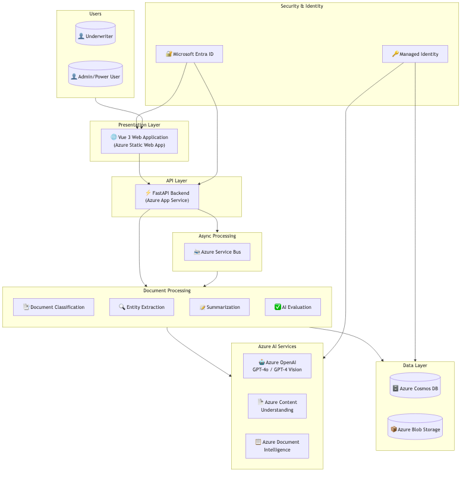
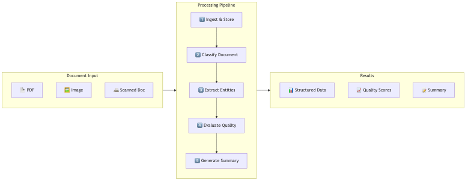
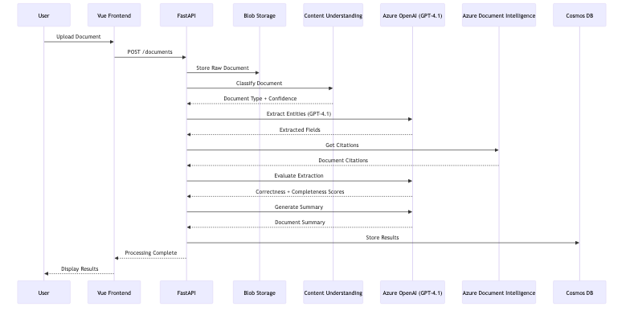
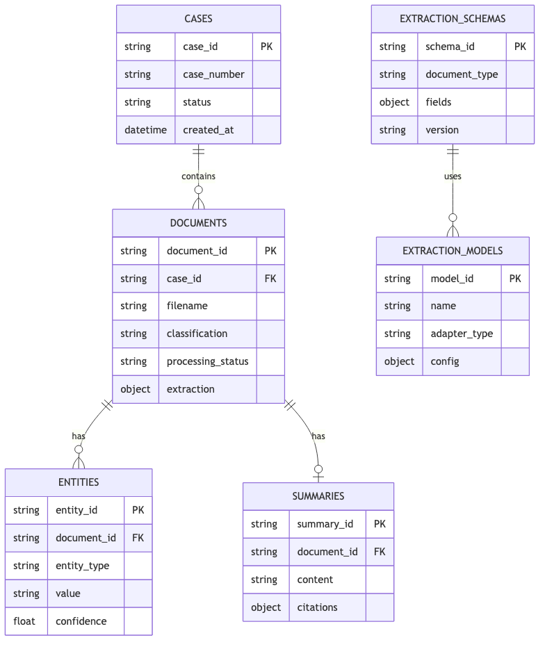
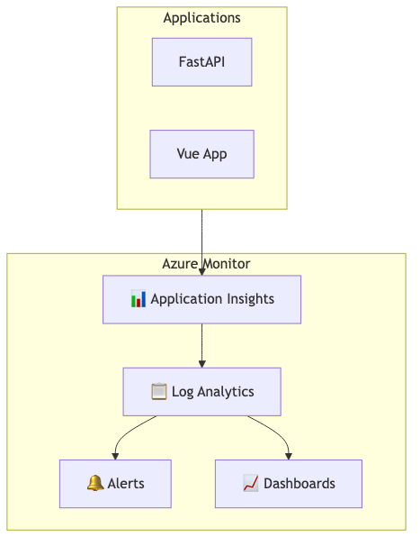

# HNW Insurance Intelligence Platform - Azure Architecture

## Overview

This document describes the Azure architecture for the Document Intelligence Platform, designed for insurance underwriting automation with extensibility for other document processing use cases.

## High-Level Architecture Diagram

## Component Architecture

## Azure Services Used

| Service | Purpose |
|---------|----------|
| **Azure App Service** | Host FastAPI backend |
| **Azure Static Web Apps** | Host Vue 3 frontend |
| **Azure Cosmos DB** | Store cases, documents, entities, schemas |
| **Azure Blob Storage** | Store raw documents and processed results |
| **Azure OpenAI Service** | GPT-4.1 for extraction |
| **Azure Content Understanding** | Document classification |
| **Azure Document Intelligence** | OCR, layout extraction, and citations |
| **Azure Service Bus** | Async message processing |
| **Microsoft Entra ID** | Authentication and authorization |
| **Azure Key Vault** | Secrets management |
| **Azure Monitor** | Logging and observability |

## Data Flow

## Cosmos DB Collections

## Security Architecture

| Layer | Security Control |
|-------|-----------------|
| **Identity** | Microsoft Entra ID (OAuth 2.0 / OIDC) |
| **API Access** | Managed Identity (no stored secrets) |
| **Network** | Private endpoints, NSGs, WAF |
| **Data at Rest** | Azure-managed encryption (AES-256) |
| **Data in Transit** | TLS 1.3 |
| **Secrets** | Azure Key Vault |
| **Audit** | Azure Monitor, Activity Logs |

## Scalability Considerations

| Component | Scaling Strategy |
|-----------|-----------------|
| **App Service** | Horizontal auto-scale based on CPU/Memory |
| **Cosmos DB** | Serverless with auto-scale RU/s |
| **Blob Storage** | Unlimited scale, geo-redundant option |
| **Azure OpenAI** | Rate limiting, request queuing |
| **Service Bus** | Partitioned queues for throughput |

## Monitoring & Observability

---

*Architecture Version: 1.0*  
*Last Updated: January 2026*
