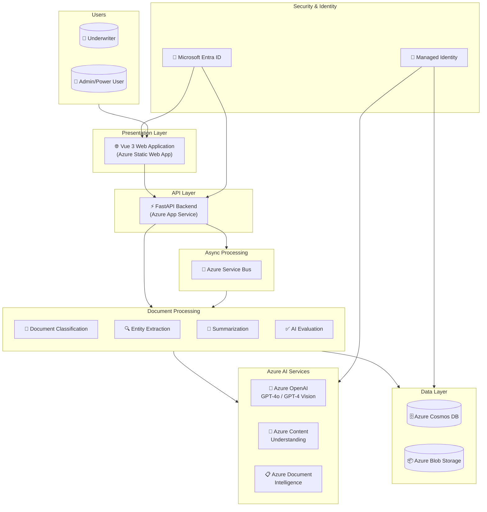
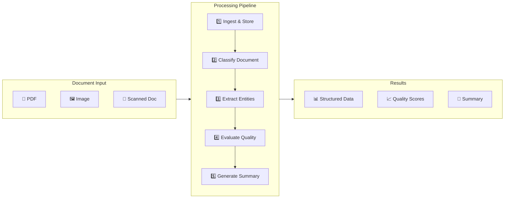
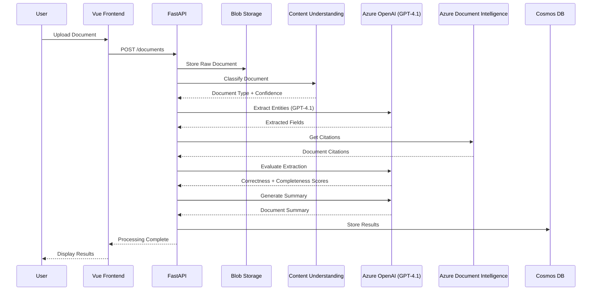
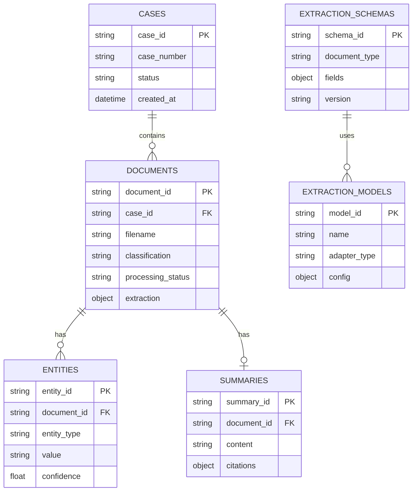
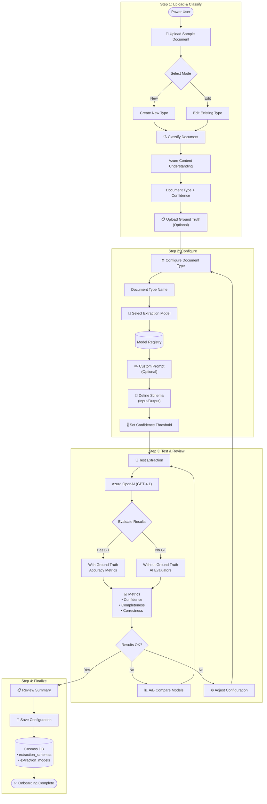
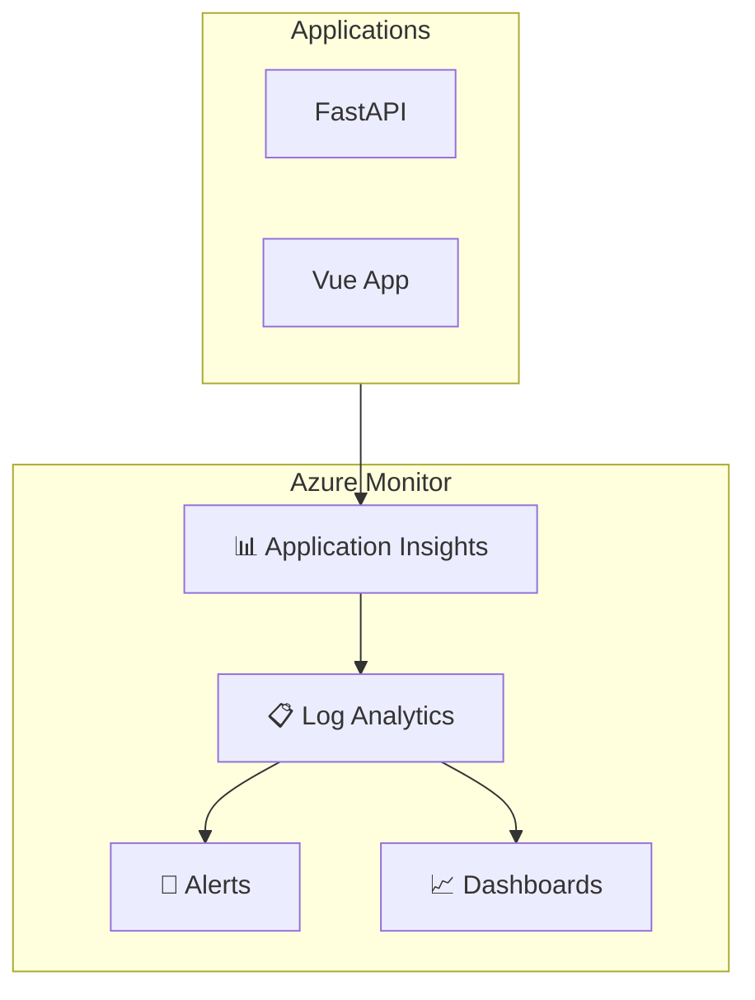

# HNW Insurance Intelligence Platform - Azure Architecture

## Overview

This document describes the Azure architecture for the Document Intelligence Platform, designed for insurance underwriting automation with extensibility for other document processing use cases.

## High-Level Architecture Diagram

## Component Architecture

## Azure Services Used

| Service | Purpose |
|---------|----------|
| **Azure App Service** | Host FastAPI backend |
| **Azure Static Web Apps** | Host Vue 3 frontend |
| **Azure Cosmos DB** | Store cases, documents, entities, schemas |
| **Azure Blob Storage** | Store raw documents and processed results |
| **Azure OpenAI Service** | GPT-4.1 for extraction |
| **Azure Content Understanding** | Document classification |
| **Azure Document Intelligence** | OCR, layout extraction, and citations |
| **Azure Service Bus** | Async message processing |
| **Microsoft Entra ID** | Authentication and authorization |
| **Azure Key Vault** | Secrets management |
| **Azure Monitor** | Logging and observability |

## Data Flow

## Cosmos DB Collections

flowchart TB
    subgraph BusinessCases["Business Cases"]
        IUW["🏥 Insurance Underwriting"]
        CUW["💳 Credit Underwriting"]
        KYC["🔍 KYC Processing"]
        Claims["📋 Claims Processing"]
    end

    subgraph Config["Business Case Configuration (Cosmos DB)"]
        BC_Config[("Business Case Configs • Pipeline Steps • Document Types • Extraction Schemas • Evaluation Rules")]
    end

    subgraph Orchestrator["Durable Functions Orchestrator"]
        Start([Start])
        LoadBC["Load Business Case Config"]
        DynamicPipeline["Execute Dynamic Pipeline"]
        End([Complete])
        
        Start --> LoadBC --> DynamicPipeline --> End
    end

    subgraph Activities["Activity Registry"]
        A1["IngestActivity"]
        A2["ClassifyActivity"]
        A3["ExtractActivity"]
        A4["EvaluateActivity"]
        A5["SummarizeActivity"]
        A6["RiskScoreActivity"]
        A7["ComplianceCheckActivity"]
        A8["FraudDetectionActivity"]
        AN["...Custom Activities"]
    end

    BusinessCases --> Config
    Config --> Orchestrator
    Orchestrator --> Activities

## Document Type Onboarding Flow

## Monitoring & Observability

---

*Architecture Version: 1.0*  
*Last Updated: January 2026*
