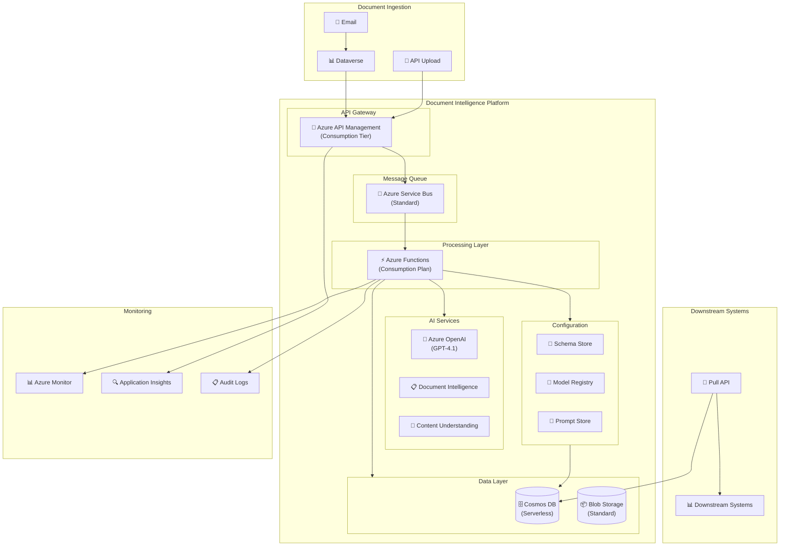
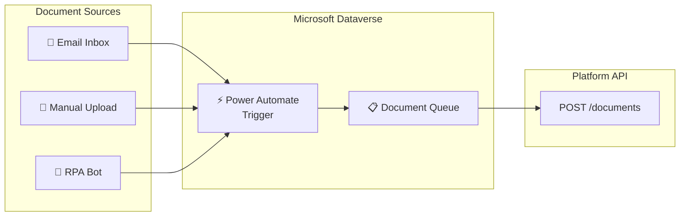
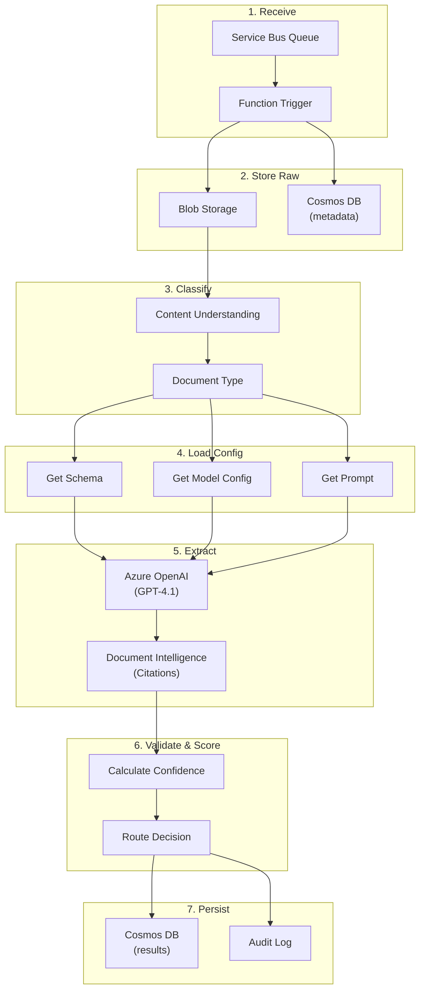
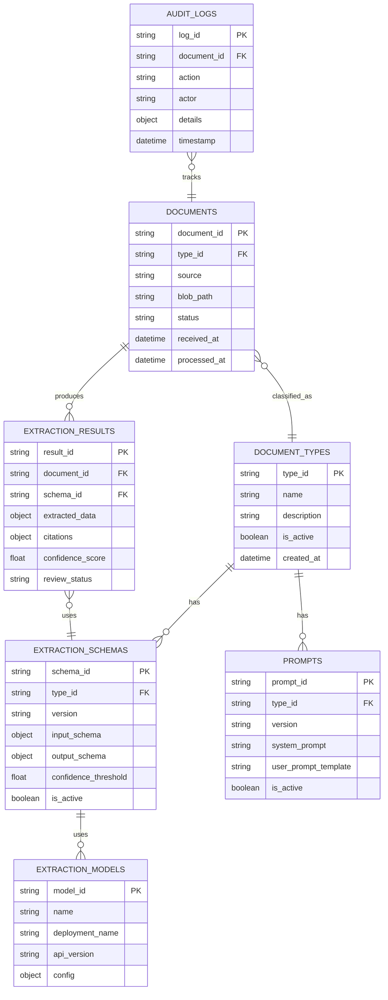
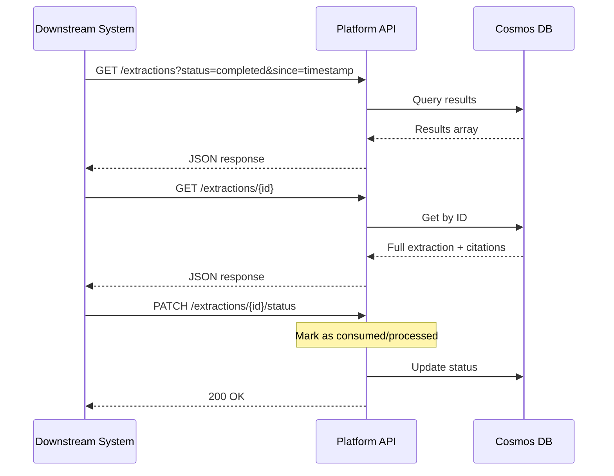
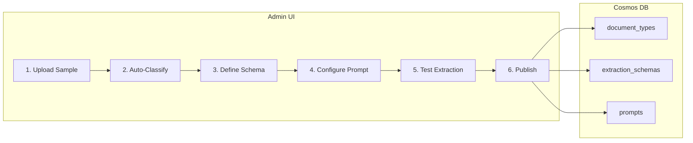
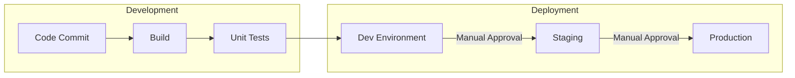

# Document Intelligence Platform - Production Architecture

## Design Principles

| Principle | Implementation |
|-----------|----------------|
| **Platform-First** | Extensible beyond underwriting; pluggable document types |
| **Cost-Optimized** | Consumption-based services; scale to zero when idle |
| **Async Processing** | Queue-based pipeline; tolerates bursts |
| **Data Residency** | All data stays in Asia region |
| **Audit Ready** | Complete logging for HK regulatory compliance |

## Architecture Overview



## Component Details

### 1. Document Ingestion



### 2. Processing Pipeline



### 3. Data Model



## Azure Services Selection

| Service | Choice | Rationale |
|---------|--------|-----------|
| **Compute** | Azure Functions (Consumption) | Pay-per-execution; scales to zero; cost-effective for async |
| **API Gateway** | API Management (Consumption) | Pay-per-call; built-in rate limiting |
| **Message Queue** | Service Bus (Standard) | Reliable delivery; dead-letter support; sessions for ordering |
| **Database** | Cosmos DB (Serverless) | Pay-per-RU; auto-scale; rich querying; global distribution ready |
| **File Storage** | Blob Storage (Standard) | Cost-effective; lifecycle management |
| **AI - Extraction** | Azure OpenAI (Pay-as-you-go) | GPT-4.1 for intelligent extraction |
| **AI - Classification** | Content Understanding | Document type detection |
| **AI - Citations** | Document Intelligence | OCR, layout, bounding boxes |
| **Monitoring** | Azure Monitor + App Insights | Centralized logging; audit trail |

## Cost Optimization

| Strategy | Implementation |
|----------|----------------|
| **Scale to Zero** | Functions Consumption plan; no idle costs |
| **Serverless DB** | Cosmos DB Serverless; pay only for operations |
| **Tiered Storage** | Hot → Cool → Archive lifecycle policies |
| **Batch Processing** | Group documents; reduce function invocations |
| **Caching** | Cache schemas/prompts; reduce Cosmos reads |
| **Reserved AI** | Consider PTU if volume grows predictably |

### Estimated Monthly Cost (Low Volume)

| Service | Estimated Cost |
|---------|----------------|
| Azure Functions | ~$20 (1000 docs/day) |
| Cosmos DB Serverless | ~$50-100 |
| Blob Storage | ~$10 |
| Service Bus | ~$10 |
| Azure OpenAI | ~$100-300 (depends on doc size) |
| Document Intelligence | ~$50-100 |
| API Management | ~$30 |
| **Total** | **~$300-600/month** |

*Note: Actual costs depend on document volume and size*

## Compliance & Audit

### HK Data Regulations

| Requirement | Implementation |
|-------------|----------------|
| **Data Residency** | All services deployed in East Asia / Southeast Asia |
| **Encryption at Rest** | Azure-managed keys (AES-256) |
| **Encryption in Transit** | TLS 1.3 enforced |
| **Access Control** | Managed Identity; no stored credentials |
| **Audit Logging** | All operations logged to Cosmos DB + Azure Monitor |

### Audit Log Schema

```json
{
  "log_id": "uuid",
  "timestamp": "2026-01-18T10:30:00Z",
  "document_id": "doc-123",
  "action": "extraction_completed",
  "actor": "system/function-app",
  "details": {
    "schema_version": "1.2.0",
    "model_used": "gpt-4.1",
    "prompt_version": "2.0.0",
    "confidence_score": 0.92,
    "processing_time_ms": 4500
  },
  "source_ip": "10.0.0.1",
  "correlation_id": "corr-456"
}
```

## Pull API for Downstream



### Pull API Endpoints

| Endpoint | Method | Description |
|----------|--------|-------------|
| `/extractions` | GET | List extractions (filter by status, date, type) |
| `/extractions/{id}` | GET | Get single extraction with full details |
| `/extractions/{id}/document` | GET | Get original document (SAS URL) |
| `/extractions/{id}/status` | PATCH | Update status (consumed, reviewed) |

## Platform Extensibility

### Adding New Document Type (No Code Deployment)



### Future Extensions

| Extension | Effort | Notes |
|-----------|--------|-------|
| New document type | Hours | Self-service via UI |
| New extraction model | Config change | Add to model registry |
| New region | Medium | Deploy same infra via Bicep |
| Multi-tenant | Medium | Partition by tenant in Cosmos |
| Real-time processing | Low | Add Event Grid trigger |

## Deployment

### Infrastructure as Code (Bicep)

```
infrastructure/
├── main.bicep
├── main.bicepparam
├── modules/
│   ├── functions.bicep
│   ├── cosmos.bicep
│   ├── servicebus.bicep
│   ├── storage.bicep
│   ├── apim.bicep
│   └── monitoring.bicep
```

### CI/CD Pipeline



## Migration Path from POC

| POC Component | Production Change |
|---------------|-------------------|
| FastAPI on App Service | Azure Functions (Consumption) |
| Vue Frontend | Keep as Static Web App |
| Cosmos DB | Keep, ensure Serverless tier |
| Blob Storage | Keep, add lifecycle policies |
| Azure OpenAI | Keep, monitor quota |
| Service Bus | Add for async processing |
| API Management | Add for gateway/throttling |

---

*Architecture Version: 2.0 (Production)*  
*Last Updated: January 2026*  
*Region: East Asia*
